# Stratum

Metadata analytics for file and object storage. Stratum walks Windows file servers, Dell PowerScale (OneFS) clusters, Linux servers and S3-compatible object stores. It builds an index of names, sizes, dates and owners (never file contents) and turns it into answers:

- what is hot or cold
- what is duplicated
- who owns what
- what is growing
- what looks risky
- what would break a move to new storage (paths too long for Windows, illegal names, folders nobody can read)

It is one Go binary. The server keeps its index in SQLite and serves the web UI. Collectors are the same binary. They run next to storage the server cannot reach and connect out to it over HTTPS.

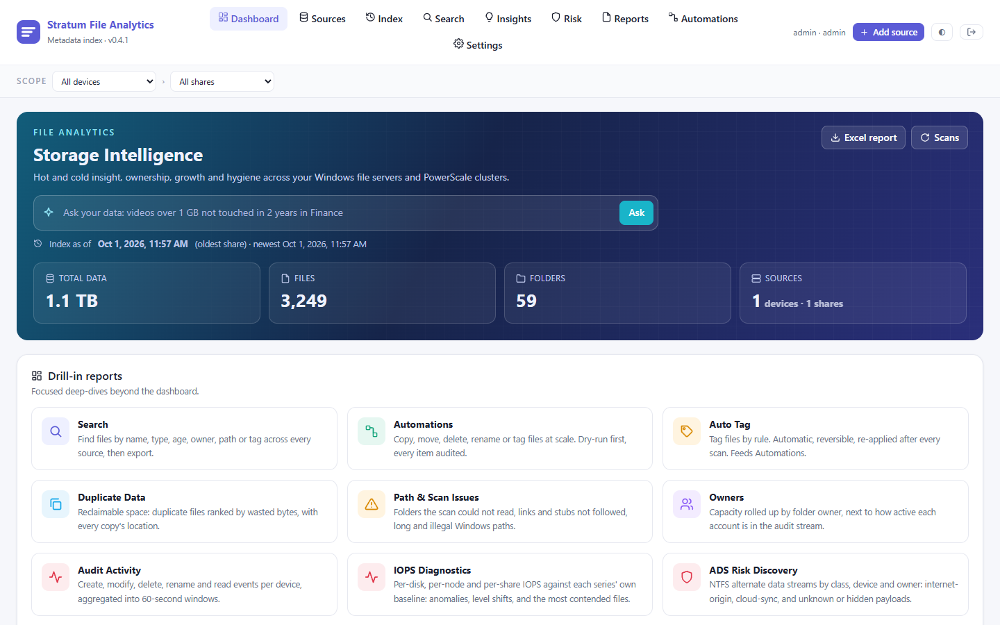

## Contents

- [Install](#install)
  - [Windows](#windows)
  - [Linux](#linux)
  - [Build from source](#build-from-source)
- [First steps](#first-steps)
- [Features](#features)
- [Screenshots](#screenshots)
- [Connecting storage](#connecting-storage)
- [Collectors](#collectors)
- [File auditing](#file-auditing)
- [Users and roles](#users-and-roles)
- [HTTPS and remote access](#https-and-remote-access)
- [Day-to-day operations](#day-to-day-operations)
- [Troubleshooting](#troubleshooting)
- [Command line reference](#command-line-reference)
- [PowerScale and S3 status](#powerscale-and-s3-status)
- [Security notes](#security-notes)
- [Development](#development)
- [License](#license)

## Install

Download the binary for your system from [Releases](https://github.com/vallentes/stratum/releases/latest):

| System | File |
|---|---|
| Windows 10 / 11 / Server 2016+ (64-bit) | `stratum-windows-amd64.exe` |
| Linux x86-64 | `stratum-linux-amd64` |
| Linux ARM64 | `stratum-linux-arm64` |

`SHA256SUMS` lists the checksum of every file.

### Windows

1. Double-click `stratum-windows-amd64.exe`.
   - The binary is not code-signed, so Windows SmartScreen may say it protected your PC. Click **More info**, then **Run anyway**.
2. Choose **1, Install the Stratum server on this PC**, and approve the administrator prompt.
3. Your browser opens on http://localhost:8470. Sign in as `admin` / `admin`. You choose a new password straight away.

Stratum now runs as the `StratumServer` service and starts with Windows.

| What | Where |
|---|---|
| Program | `C:\Program Files\Stratum Server\stratum.exe` |
| Index, settings and log (`stratum.log`) | `C:\ProgramData\Stratum\server-data` |

To open the UI from other computers, allow the port through Windows Firewall from an administrator prompt:

```
netsh advfirewall firewall add rule name="Stratum" dir=in action=allow protocol=TCP localport=8470
```

To remove the service (the index is kept):

```
"C:\Program Files\Stratum Server\stratum.exe" -uninstall-server
```

You can also run it in a terminal without installing anything:

```
stratum-windows-amd64.exe -addr :8470 -data .\data
```

### Linux

```
sudo useradd --system --home /opt/stratum --shell /usr/sbin/nologin stratum
sudo mkdir -p /opt/stratum/data
sudo install -m 755 stratum-linux-amd64 /opt/stratum/stratum
sudo chown -R stratum:stratum /opt/stratum
```

Create `/etc/systemd/system/stratum.service`:

```ini
[Unit]
Description=Stratum File Analytics
After=network-online.target
Wants=network-online.target

[Service]
User=stratum
Group=stratum
WorkingDirectory=/opt/stratum
ExecStart=/opt/stratum/stratum -addr :8470 -data /opt/stratum/data
Restart=always
RestartSec=5
NoNewPrivileges=true
# Read every file's metadata without running as root.
AmbientCapabilities=CAP_DAC_READ_SEARCH
CapabilityBoundingSet=CAP_DAC_READ_SEARCH
ProtectSystem=strict
ReadWritePaths=/opt/stratum/data

[Install]
WantedBy=multi-user.target
```

Then start it and open `http://<server>:8470`:

```
sudo systemctl daemon-reload
sudo systemctl enable --now stratum
```

Sign in as `admin` / `admin`. You choose a new password straight away.

### Build from source

Needs Go 1.26 or newer. No C compiler is needed: SQLite is pure Go.

```
git clone https://github.com/vallentes/stratum
cd stratum
go build -o stratum .
./stratum -addr :8470 -data ./data
```

## First steps

1. **Sign in.** Use `admin` / `admin` and choose your own password. The sign-in hint about the default password disappears once it is changed.
2. **Add a source.** Click **Add source**, then pick where the storage lives:
   - **Reachable from this server:** this machine's drives, a Windows server by name, a PowerScale cluster, or an S3 / ObjectScale endpoint.
   - **In another network:** set up a [collector](#collectors) first.
3. **Pick the shares.** Stratum discovers drives, SMB shares, PowerScale shares and S3 buckets. Tick the ones you want, or type a custom path. Choose a schedule (manual, daily, weekly).
4. **Watch the scan.** The **Index** page shows live progress:
   - files and folders per second
   - the folder being read
   - an estimate based on the previous scan
5. **Explore.** Reports fill in the moment a scan is published. A scan that fails or is cancelled never replaces the last good index.

## Features

**Index**

- Parallel metadata walk of:
  - Windows drives and SMB shares
  - PowerScale (OneFS RAN API)
  - Linux mount points
  - S3 and Dell ObjectScale buckets
- A share's index is replaced only when a scan finishes cleanly.
- Crash-resume: an interrupted scan continues from the folders it already finished.
- Live index updates from audit events between full scans.
- One scan per physical disk at a time, so partitions of one drive never fight. Separate disks are scanned in parallel.
- Per-share exclusions, with presets:
  - recycle bin and system files
  - code folders
  - macOS leftovers
  - snapshots
  - container storage
- Optional NTFS alternate data stream discovery.

**See**

- **Dashboard:**
  - hot/cold by age
  - top folders at any depth
  - growth with a 6-month projection
  - file types
  - top owners
- **Insights:** ranked recommendations with estimated monthly savings. They cover cold data, duplicates, junk, PST files, orphaned owners, stale shares and a capacity forecast.
- **Risk:**
  - ransomware extensions and ransom notes
  - credentials and keys stored by name
  - database dumps and VM disks
  - mass-change bursts from audit
- **Owners:** by account, Active Directory department and OU tree (LDAP).
- **Path and scan issues**, with triage:
  - unreadable folders
  - links and stubs
  - Windows path length
  - illegal and reserved names
- **Audit activity:** OneFS protocol audit over syslog and the Windows Security log.
- **IOPS diagnostics** and **device inventory**.
- Excel and CSV export.

**Find and act**

- Search by name, type, age, size, owner, path and tag. A plain-English "Ask" box turns questions into searches.
- In-browser viewer for:
  - text
  - images and PDF
  - audio and video
  - Word, RTF and Excel

  Only indexed files can be opened, and every view is logged.
- Duplicate sets: name + size + date for files, ETag for objects.
- **Auto Tag** rules.
- **Automations** (copy, move, delete, rename, tag), with:
  - a dry run
  - typed confirmation for destructive runs
  - a per-item ledger

**Run it**

- Users with three roles: viewer, editor and admin.
- Collectors install from a pre-configured download. They run as a Windows service and update themselves when the server is upgraded.
- HTTPS directly by IP, using a self-signed certificate that collectors pin, or behind any reverse proxy.

## Screenshots

| | |
|---|---|
| 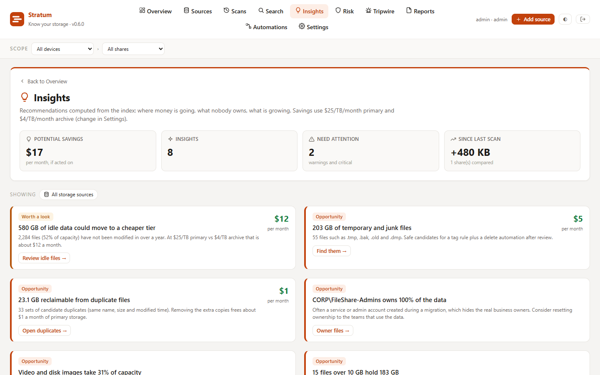 **Insights** with estimated savings | 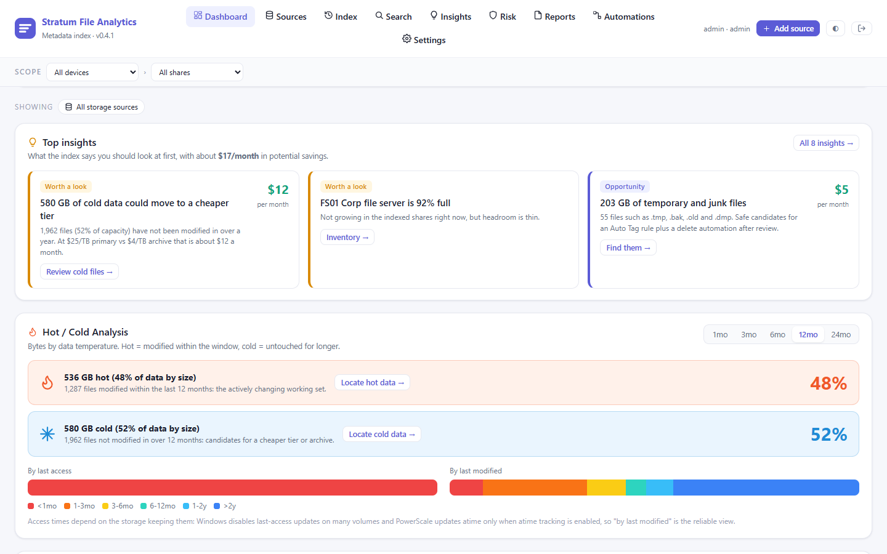 **Hot / cold** by modified and accessed time |
| 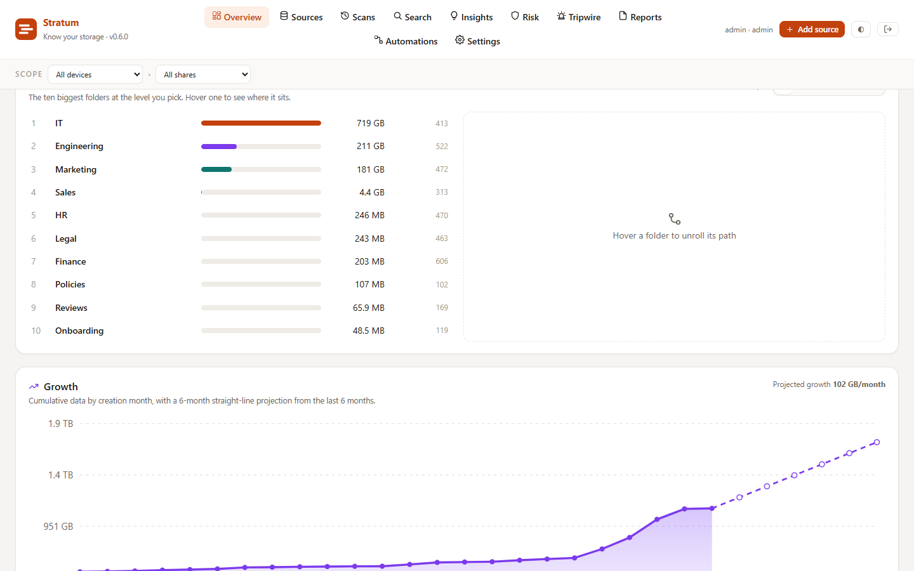 **Top folders and growth projection** | 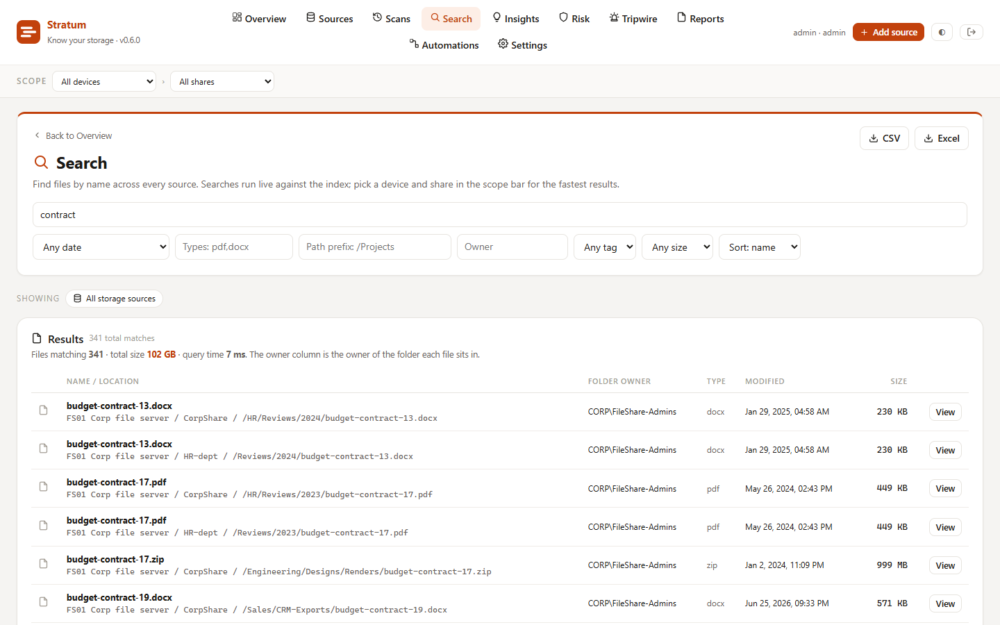 **Search** across every source |
| 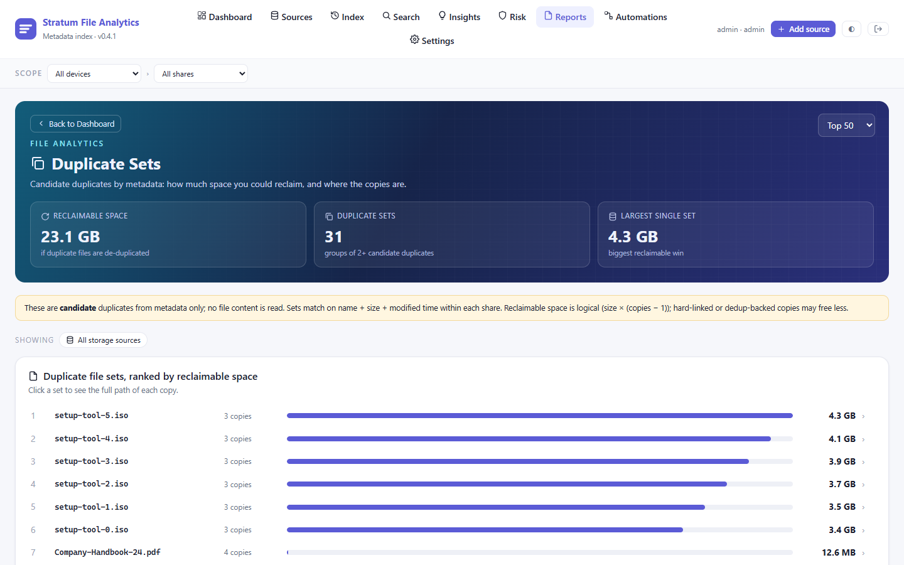 **Duplicate sets** and reclaimable space | 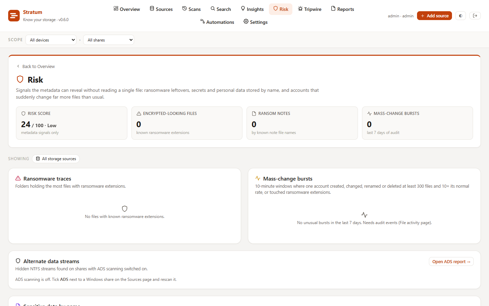 **Risk** signals from metadata alone |
| 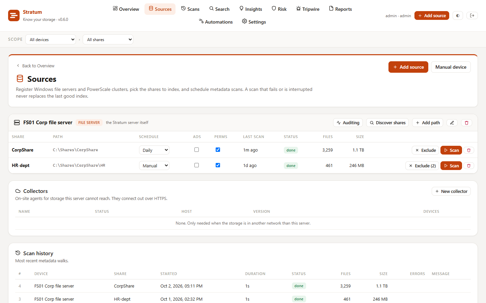 **Sources**, shares, schedules and collectors | 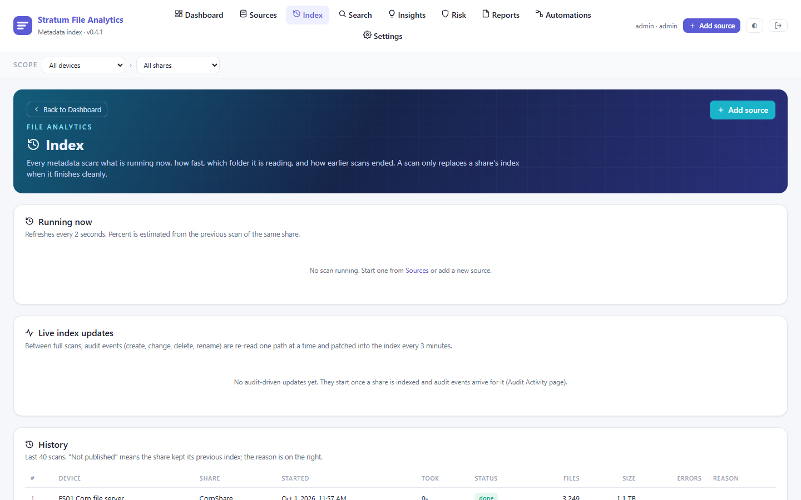 **Index**: live scan progress and history |
| 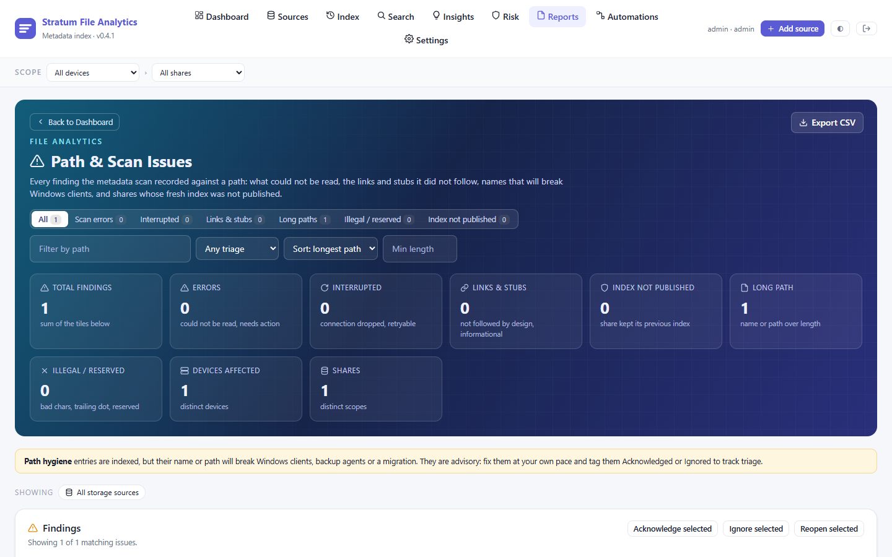 **Path and scan issues** with triage | 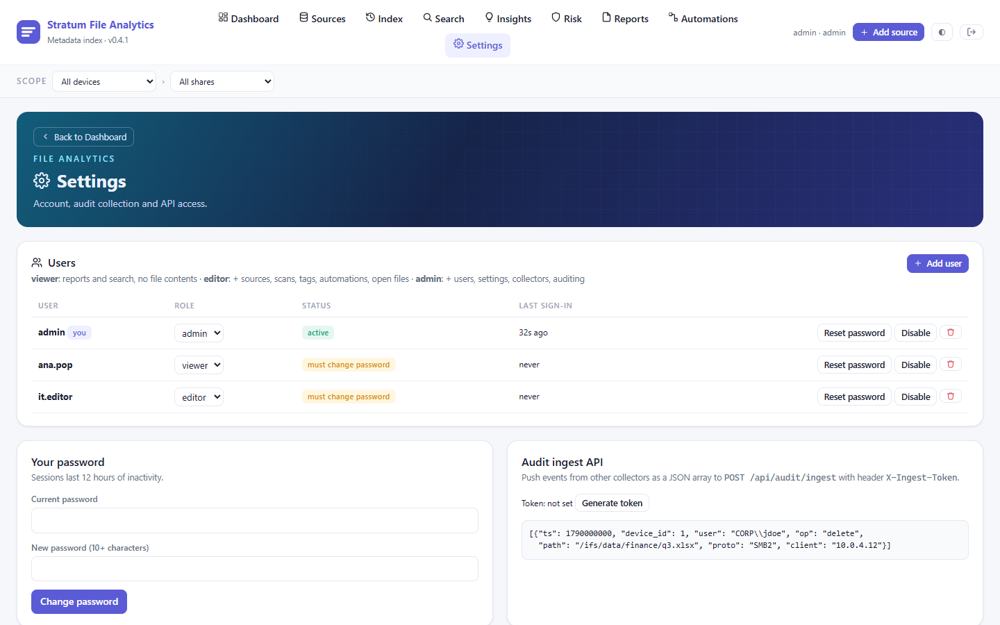 **Users and roles** |

## Connecting storage

**This machine.** Leave the server field empty.

- Windows: lists the local drives.
- Linux: lists real mounted filesystems. It skips `/proc`, `tmpfs`, overlays, snaps and container layers.

**Windows file server by name.** Enter the server name and a `DOMAIN\user` with read access to the shares.

- This works when Stratum itself runs on Windows. From a Linux server, use a collector on a Windows machine.
- Backup Operators membership lets the account read folders it has no ACL entry on.

**Dell PowerScale.** Enter the cluster address. The OneFS API on port 8080 is used. Create a read-only role with these privileges:

| Privilege | Access | Needed for |
|---|---|---|
| `ISI_PRIV_LOGIN_PAPI` | | Signing in to the API |
| `ISI_PRIV_NS_TRAVERSE` | | Walking folders |
| `ISI_PRIV_NS_IFS_ACCESS` | read | Reading file metadata |
| `ISI_PRIV_SMB` | read | Share discovery |
| `ISI_PRIV_STATISTICS` | read | Inventory and IOPS |
| `ISI_PRIV_CLUSTER` | read | Inventory and IOPS |

The RAN (namespace) API must be enabled. Automations additionally need write access on the namespace.

**S3 and ObjectScale.** Enter the endpoint, then the access key as the username and the secret key as the password. Buckets are discovered as shares.

Credentials are encrypted at rest with a key kept in the data folder.

## Collectors

Use a collector when the storage is in a network the server cannot reach, for example a branch office or the inside of a customer domain. The collector connects out to the server over HTTPS, so nothing has to be opened inbound.

1. Go to **Sources**, then **Collectors**, then **New collector**, and give it a name.
2. Click **Download Windows installer**. The download already contains the server address, the token and the certificate fingerprint.
3. Double-click it on a machine next to the storage and approve the administrator prompt.

It installs the `StratumCollector` service:

| What | Where |
|---|---|
| Program | `C:\Program Files\Stratum` |
| Log | `C:\ProgramData\Stratum\collector-data\collector.log` |

The collector shows as online within seconds. Use **Add source** and pick it.

Collectors update themselves when the server is upgraded. They wait for running scans to finish first.

On Linux, run the collector under systemd:

```
/opt/stratum/stratum collector -server https://your-server:8470 -token stc_... -pin <sha256>
```

The fingerprint for `-pin` is printed in the server log at start-up.

## File auditing

Audit events feed the Audit Activity page, the busiest-files and busiest-clients tables, mass-change detection and live index updates.

**Windows.** On **Sources**, click **Auditing** on a device and switch it on per share. This sets the audit policy and the folder audit entries (SACL) through the collector or the local server. The page shows the job's progress on large drives. Turning it off removes what Stratum added.

The collector or server must run as a service (LocalSystem) to read the Security log.

**PowerScale.** Enable protocol auditing on the access zone and forward it to the Stratum server's syslog port:

- UDP/TCP 5514 by default
- change it with `-syslog`

## Users and roles

| Role | Can |
|---|---|
| viewer | Reports, dashboards and search. Cannot open file contents. |
| editor | Everything a viewer can, plus: add sources, run scans, manage tags and automations, view and download files. |
| admin | Everything an editor can, plus: manage users, settings, collectors and file auditing. |

Admins add users under **Settings**, then **Users**. They set a temporary password, which the user replaces at their first sign-in. Admins can also reset passwords, change roles and disable accounts. The last active admin cannot be demoted, disabled or deleted.

Sign-in pauses for one minute after 10 failed attempts from the same address within 15 minutes. Failed sign-ins are written to the server log with the reason.

## HTTPS and remote access

To serve HTTPS directly by IP, with no domain or proxy, add `-tls-addr`:

```
./stratum -addr 127.0.0.1:8470 -tls-addr 203.0.113.10:8443 -data ./data
```

A self-signed certificate is created once and kept in the data folder. Browsers warn about it once. Collectors pin its SHA-256 fingerprint, so do not delete `tls-cert.pem` and `tls-key.pem`.

Behind a reverse proxy (Caddy, nginx, IIS), proxy to the HTTP port and pass `X-Forwarded-Proto: https`.

## Day-to-day operations

**Backup.** Copy the data folder while the service is stopped:

- `stratum.db` holds the index and settings.
- `secret.key` decrypts stored credentials.
- `tls-*.pem` is the certificate that collectors pin.

**Upgrade.** Stop the service, replace the binary, start it. Database changes apply automatically. Collectors pick up the new version on their own.

**Moving.** Copy the whole data folder to the new machine.

## Troubleshooting

**"wrong username or password."**

- Check what the password manager filled in: the **Show** button next to the password field reveals it.
- Usernames are not case-sensitive.
- Spaces that a password manager adds around a password are ignored.

**"too many failed attempts."** Wait the number of seconds shown. Only that username from your address is paused.

**Forgot the admin password.** Another admin can set a temporary one under **Settings**, then **Users**. If you are the only admin, set one on the server, then sign in with it and choose a new one:

- **Windows:** stop the `StratumServer` service, then run:

  ```
  "C:\Program Files\Stratum Server\stratum.exe" -data "C:\ProgramData\Stratum\server-data" -reset-password TemporaryPass1
  ```

  Start the service again.
- **Linux:**

  ```
  sudo systemctl stop stratum
  sudo -u stratum /opt/stratum/stratum -data /opt/stratum/data -reset-password TemporaryPass1
  sudo systemctl start stratum
  ```

**No drives or shares are discovered.**

- Windows servers in another network need a collector.
- The Linux server only lists real filesystems. Add other paths with **Add path**.

**A scan shows errors.** The **Path and scan issues** page lists every folder that could not be read, and why. Usually the service account lacks read access.

**Search asks for a filter.** Searching millions of files with no filter at all is refused on purpose. Add a word, a type, a size or a path.

**Where are the logs?**

| Install | Log |
|---|---|
| Windows server service | `C:\ProgramData\Stratum\server-data\stratum.log` |
| Linux | `journalctl -u stratum` |
| Collector | `C:\ProgramData\Stratum\collector-data\collector.log` |

## Command line reference

**Server**

| Flag | Default | Meaning |
|---|---|---|
| `-addr` | `:8470` | HTTP listen address |
| `-data` | `data` | Data folder (index, key, certificate) |
| `-tls-addr` | | Also serve HTTPS with a self-signed certificate on this address |
| `-syslog` | `:5514` | Receive OneFS audit syslog (UDP and TCP); empty disables it |
| `-reset-password` | | Set a temporary password for `-user` (default `admin`) and exit |
| `-list-shares` | | Print devices and shares and exit |
| `-delete-share` | | Remove one share's index (nothing on the storage) and exit |
| `-install-server` | | Windows: install the `StratumServer` service on port 8470 |
| `-uninstall-server` | | Windows: remove that service (the index is kept) |
| `-pprof` | | Serve Go profiling on this address (keep it on 127.0.0.1) |

**Collector:** `stratum collector`

| Flag | Default | Meaning |
|---|---|---|
| `-server` | | Server URL |
| `-token` | | Collector token from the server |
| `-pin` | | Trust only the server certificate with this SHA-256 fingerprint |
| `-insecure` | | Accept any server certificate |
| `-data` | | Local state folder |
| `-syslog` | `:5514` | Receive OneFS audit syslog |
| `-install` | | Windows: install the `StratumCollector` service |
| `-uninstall` | | Windows: remove that service |

## PowerScale and S3 status

**S3.**

- Request signing is verified against the AWS Signature Version 4 examples published in the Amazon S3 API reference.
- Bucket listing, paging, owners and ETag duplicates are tested against a mock S3 endpoint.
- Not yet run against a live AWS account or ObjectScale cluster.

**PowerScale.**

- These are tested against a mock built from the OneFS 9.x API reference:
  - share discovery across access zones
  - inventory
  - the RAN directory walk with resume paging
  - session authentication
- Not yet run against a real cluster. Check the field names, RBAC privileges and the protocol audit syslog format on first use.

Reports from real systems are welcome as issues.

## Security notes

- Passwords are bcrypt-hashed. Sign-in is throttled after repeated failures. Sessions expire after 12 hours idle.
- Device credentials are encrypted at rest with a key in the data folder (`secret.key`). Back the data folder up and keep it private.
- Collectors authenticate with per-collector tokens, stored hashed, and pin the server certificate.
- The file viewer refuses files that look like secrets (keys, `.env`, password stores). It serves active content (HTML, SVG) as plain text in a sandbox.
- Automations change data:
  - Dry-run first.
  - Destructive real runs and schedules require typing the automation's name.

## Development

```
go vet ./...
go test ./...
```

Tests cover:

- scanning, publish rules and crash-resume
- re-added shares starting clean
- collectors end to end
- S3 signing and listing
- PowerScale (mock)
- live updates and the viewer's path guard
- users, roles and sign-in
- exports and exclusions

CI runs them on Windows and Linux. Pushing a `v*` tag builds the release binaries.

## License

[PolyForm Noncommercial 1.0.0](LICENSE), with the required notice in [NOTICE](NOTICE). You may use, study, change and share Stratum for any noncommercial purpose, including:

- personal use
- research and education
- use by charities, schools and public bodies

**Commercial use needs a license from the author.** That includes:

- selling Stratum or a product built on it
- offering it as a paid or hosted service
- using it inside a business

Get in touch through [github.com/vallentes](https://github.com/vallentes).
